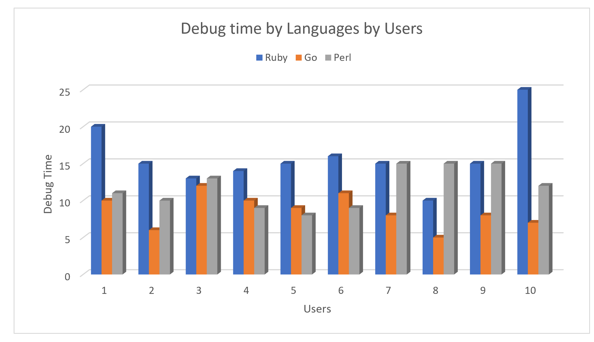
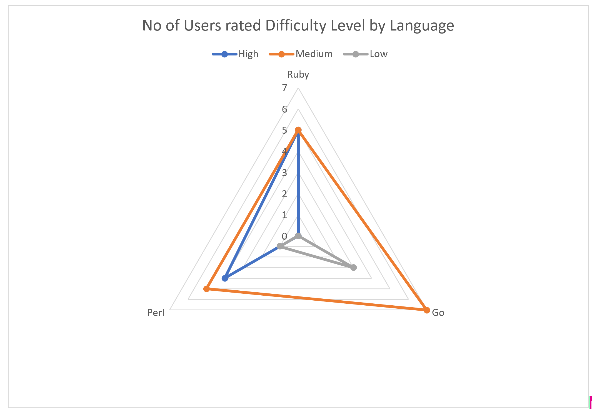
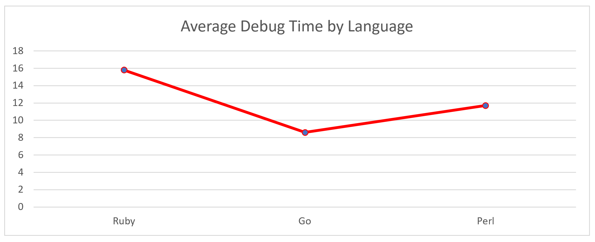

# Results of Homework 3
## Methods:
Criteria based on which the rank of a language is determined:
 
Based on the data collected from the experiments, we tried to use a combination of parameters to determine how each of the three languages in question fare in comparison to each other. Following are the factors considered:
 
•	Debug time (contributes highly considering the scope of the homework)
 
•	Difficulty
 
•	Prior knowledge
 
We are increasing debug time for the observations where the users have prior knowledge of the data. To minimize the impact of prior knowledge on debug time.

## Materials:
We have used google sheets and tokens to anonymously collect data from the subjects. 
https://docs.google.com/spreadsheets/d/1cYCGiiqwOXcH7xveMVOphOmT0MoK0BAt6QrtL8388rQ/edit#gid=0

### Online Compiler links
Perl : https://www.onlinegdb.com/online_perl_compiler
 
Ruby : https://www.onlinegdb.com/online_ruby_compiler
 
Go : https://www.onlinegdb.com/online_go_compiler

## Observations:

## Conclusions:
•	The average time to debug the GOL program in Ruby is 15.8, in PERL it is 11.4 and 8.6 in Go. It can be observed that Ruby takes a longer to take followed by Perl and then Go.
 
•	Participants rated Go to be of low and Medium difficulty to understand. However, Ruby is rated of High difficulty by 5 and Perl by 4. Upon the analysis, it is observed that Ruby and Perl are close in the complexity to understand. In comparison Go looks to be more intuitive for most of the participants.
 
Following is the ranking of the 3 languages, from best to worst based on the data:
#### Go > Perl > Ruby

## Threats to Validity:
### Insufficient data collections: 
Unable to take a decision on which language is better just based on Debug Time, Prior Knowledge attributes.
 
We should have users to pick a language which they would likely use in future. Which will help us understand the language preferences.

### Quantifying Categorical data: 
We have collected prior knowledge as (0-3 scale) . Users may not be able to decide where exactly they stand. 
 
We have given users to rate a language difficulty as High, Medium, Low. Users perception of difficulty can vary widely.
### Online Compilers:
Some users wanted to run debugger on code but the online compiler limited their scope.

